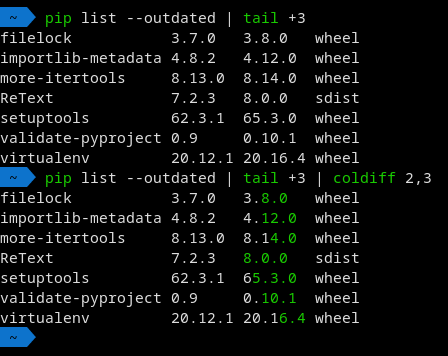

# Column Differ

```
$ coldiff --help
Usage: coldiff source_col,target_col
Colors the suffix of target column differing from source column.

source_col and target_col are the column numbers of source and target columns
respectively. Each column is separated by one or more whitespace characters.
```

Example:

